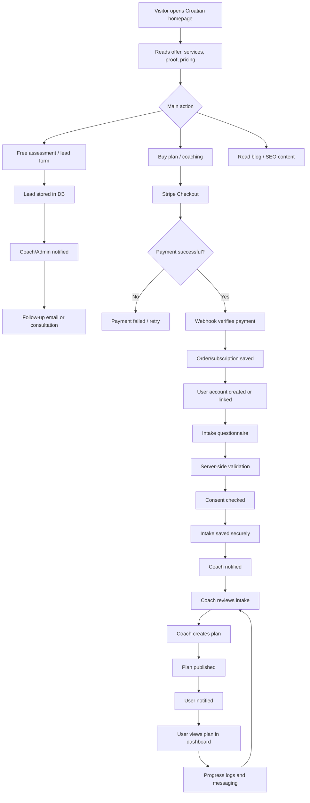
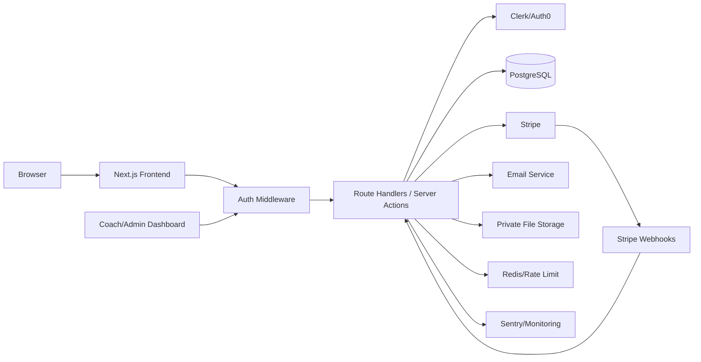

# Technical Blueprint — Fitness, Diet & Online Coaching Platform

## 1. Product Design Requirements — PDR

### Summary

Build a bilingual Croatian/English fitness coaching platform that converts visitors into leads and paying clients, collects user intake data securely, enables personalized plan delivery, and supports online coaching through user and coach dashboards.

### Project Vision

Create a premium, non-generic coaching platform that combines:

- Fitness expertise
- Diet and workout personalization
- Trust-building content
- Strong conversion funnels
- Secure client data handling
- Coach/admin workflow tools

The product should not feel like a generic SaaS template. It should feel like a serious Croatian fitness brand with real-world athletic credibility.

### Target Users

#### Public visitors

- People looking for custom workout plans
- People looking for custom diet plans
- Beginners who need guidance
- Intermediate lifters/trainees
- Busy adults
- Users interested in boxing, strength training, muscle gain, fat loss, conditioning, and general fitness

#### Registered users

- Paying clients
- Leads who started intake
- Subscription clients
- Users tracking progress

#### Internal users

- Coach
- Admin
- Support/operator role if needed later

### Core Features

#### Public Website

- Croatian default language
- English language option
- Homepage
- Services
- Pricing
- About/coaches
- Testimonials
- FAQ
- Contact form
- Blog/SEO articles
- Conversion CTAs

#### Sales Funnel

```txt
Landing page
→ Service selection
→ Checkout
→ Account creation/login
→ Intake form
→ Coach review
→ Plan delivery
```

#### User Dashboard

- Profile
- Intake questionnaire
- Purchased plans
- Workout plan view
- Diet/meal plan view
- Progress logs
- Progress photos
- Coach messages
- Billing/subscription status

#### Coach/Admin Dashboard

- Client list
- Intake review
- Plan builder
- Meal plan builder
- Workout plan builder
- Progress review
- Messaging
- Orders/subscriptions
- Audit logs

### Functional Requirements

| Area | Requirement |
|---|---|
| Localization | Croatian default, English optional. |
| Authentication | Users can sign up, log in, reset password, and manage account. |
| Authorization | Roles: guest, user, coach, admin. |
| Payments | One-time and subscription payments through Stripe. |
| Intake | Multi-step questionnaire with consent before sensitive data submission. |
| Plan Delivery | Coaches can create and publish custom plans. |
| Dashboard | Users can view plans, billing, progress, and messages. |
| Admin | Admins can manage clients, plans, orders, and roles. |
| Uploads | Optional progress photos/files with validation and private access. |
| Notifications | Email confirmation, plan-ready notification, message notification. |
| SEO | Server-rendered public pages, metadata, structured headings, blog. |

### Non-Functional Requirements

| Area | Requirement |
|---|---|
| Security | Auth middleware, RBAC, server validation, sanitized errors, HTTPS. |
| Privacy | Minimize sensitive data; collect explicit consent. |
| Performance | Fast mobile load, optimized images, code splitting. |
| Accessibility | Follow WCAG 2.2 AA-oriented practices. |
| Maintainability | TypeScript, documented architecture, reusable components. |
| Scalability | Modular app that can later split into services if needed. |
| Reliability | Monitoring, error logging, webhook idempotency. |

### Problem Solved

The product helps fitness clients move from confusion to personalized action:

```txt
Confused visitor
→ Understands offer
→ Trusts coaches
→ Buys plan
→ Gives structured intake data
→ Receives custom workout/diet plan
→ Gets ongoing support
```

---

## 2. Tech Stack

### Frontend

| Technology | Purpose |
|---|---|
| Next.js App Router | Full-stack framework, routing, server components, route handlers. |
| React | Component-based UI. |
| TypeScript | Safer code and better architecture. |
| Tailwind CSS | Fast custom styling and responsive design. |
| shadcn/ui | Accessible, customizable UI primitives. |
| Framer Motion | Smooth premium animations. |
| React Hook Form | Efficient form handling. |
| Zod | Validation schemas. |
| TanStack Query | Dashboard server-state caching and mutations. |
| next-intl | Croatian/English localization. |

### Backend

| Technology | Purpose |
|---|---|
| Next.js Route Handlers | API endpoints. |
| Server Actions | Secure form/action handling where appropriate. |
| PostgreSQL | Main relational database. |
| Supabase | Managed Postgres/storage option. |
| Prisma | ORM and type-safe DB access. |
| Redis/Upstash | Rate limits, caching, queues if needed. |
| Stripe | Payments, subscriptions, checkout, billing portal. |
| Resend/Postmark | Transactional email. |
| Sentry | Error monitoring. |

### Auth and Security

| Technology | Purpose |
|---|---|
| Clerk/Auth0 | Battle-tested authentication. |
| Middleware | Route protection. |
| RBAC | Role-based access. |
| Zod | Validate untrusted input. |
| Private object storage | Secure progress photos/files. |
| Vercel/AWS/GCP | Secure hosting with HTTPS and platform protections. |

### Recommended MVP Architecture

```txt
Next.js Monolith
├── Public marketing website
├── Authenticated user dashboard
├── Coach/admin dashboard
├── API route handlers
├── Server actions
├── PostgreSQL database
├── Stripe
├── Clerk/Auth0
├── File storage
└── Email service
```

Why monolith first:

- Faster development
- Shared TypeScript types
- Easier deployment
- Lower infrastructure complexity
- Good enough for MVP and early business validation

---

## 3. App Flowchart

### User Journey



### System Architecture



---

## 4. Project Rules

### Coding Standards

- Use TypeScript strictly.
- Avoid `any`.
- Validate all input server-side.
- Keep business logic out of UI components.
- Use service functions for domain logic.
- Use repository functions for DB access.
- Centralize permissions.
- Centralize API errors.
- Sanitize user-facing errors.
- Never expose secrets on frontend.

### Git Strategy

```txt
main          → production-ready branch
develop       → integration branch
feature/*     → new features
fix/*         → bug fixes
hotfix/*      → urgent production fixes
release/*     → release preparation
```

### Pull Request Checklist

Every PR should include:

- Clear summary
- Screenshots for UI changes
- Testing notes
- Security impact
- Accessibility impact
- Migration notes if DB changed
- Linked issue/task

### Testing Rules

Use:

- Vitest for unit tests
- React Testing Library for component behavior
- Playwright for E2E flows
- Stripe webhook tests
- Auth/RBAC tests
- Upload validation tests

Critical flows to test:

- Sign up/login
- Checkout
- Webhook payment confirmation
- Intake submission
- Plan publishing
- User viewing own plan
- User blocked from other users' data
- Coach/admin permissions
- Upload validation

### Performance Rules

- Use Server Components for mostly static public content.
- Use Client Components only when needed.
- Optimize images.
- Lazy-load heavy dashboard widgets.
- Split admin-only code.
- Cache public content.
- Minimize third-party scripts.
- Defer analytics.

### Accessibility Rules

- Semantic headings
- Keyboard navigation
- Visible focus states
- Labels for inputs
- Error text connected to inputs
- Accessible buttons and links
- Good contrast
- Alt text for meaningful images
- Respect reduced motion

---

## 5. Implementation Plan

### Phase 1 — Planning and Scope

Timeline: 3–5 days

Tasks:

1. Define packages and pricing.
2. Define roles and permissions.
3. Define intake questionnaire.
4. Define sitemap.
5. Define database entities.
6. Define legal pages.
7. Define health/fitness disclaimer.

Deliverables:

- Product scope
- Sitemap
- Intake form outline
- Data model draft
- MVP feature list

### Phase 2 — Project Setup

Timeline: 2–3 days

Tasks:

1. Create Next.js TypeScript app.
2. Add Tailwind CSS.
3. Add shadcn/ui.
4. Configure ESLint and Prettier.
5. Add folder structure.
6. Configure `.env` and `.gitignore`.
7. Add GitHub repository.
8. Add CI checks.

### Phase 3 — Design System and Public Site

Timeline: 1–2 weeks

Tasks:

1. Create typography and color system.
2. Build UI primitives.
3. Build homepage.
4. Build services page.
5. Build pricing page.
6. Build about/coaches page.
7. Build FAQ.
8. Build contact/lead form.
9. Add Croatian/English localization.
10. Add SEO metadata.

### Phase 4 — Auth and RBAC

Timeline: 3–5 days

Tasks:

1. Integrate Clerk/Auth0.
2. Add middleware.
3. Create roles.
4. Protect dashboard and admin routes.
5. Add server-side permission helpers.
6. Test route protection.

### Phase 5 — Database

Timeline: 3–5 days

Core models:

- User
- Profile
- Role
- Order
- Subscription
- IntakeForm
- WorkoutPlan
- MealPlan
- ProgressLog
- Message
- File
- AuditLog

### Phase 6 — Payments

Timeline: 4–7 days

Tasks:

1. Create Stripe products/prices.
2. Create checkout session endpoint.
3. Add checkout UI.
4. Add webhook endpoint.
5. Verify webhook signatures.
6. Save order/subscription status.
7. Unlock dashboard after webhook confirmation.

### Phase 7 — Intake Questionnaire

Timeline: 1 week

Tasks:

1. Multi-step form.
2. Client-side validation.
3. Server-side validation.
4. Consent checkbox.
5. Save partial progress.
6. Admin review screen.

### Phase 8 — User Dashboard

Timeline: 1–2 weeks

Routes:

```txt
/dashboard
/dashboard/intake
/dashboard/plans
/dashboard/progress
/dashboard/messages
/dashboard/billing
/dashboard/settings
```

### Phase 9 — Coach/Admin Dashboard

Timeline: 1–2 weeks

Routes:

```txt
/admin
/admin/clients
/admin/clients/[id]
/admin/orders
/admin/plans
/admin/messages
/admin/settings
```

### Phase 10 — Testing, Hardening, Deployment

Timeline: 1 week

Tasks:

1. E2E tests.
2. Security review.
3. Accessibility review.
4. Performance audit.
5. Webhook tests.
6. Upload tests.
7. Rate limits.
8. Production deployment.
9. Domain and HTTPS.
10. Monitoring setup.

---

## 6. Frontend Guidelines

### Design Principles

The frontend should be:

- Mobile-first
- Fast
- Accessible
- Conversion-focused
- Non-generic
- Fitness-themed
- Visually strong
- Human and trustworthy

### UX Rules

- One main CTA per section.
- Pricing must be simple.
- Benefits must be clear.
- Do not overwhelm visitors.
- Use social proof before payment CTA.
- Make intake feel guided, not intimidating.
- Use progress bars in long forms.
- Keep dashboard clean and task-oriented.

### Component Architecture

```txt
components/
├── ui/
├── marketing/
├── forms/
├── dashboard/
├── admin/
└── shared/
```

### Styling Rules

- Tailwind CSS as main styling system.
- Use consistent spacing.
- Use reusable variants.
- Keep animations subtle.
- Respect reduced motion.
- Use semantic HTML.
- Design for mobile first.

### State Rules

| State | Tool |
|---|---|
| Form state | React Hook Form |
| Server state | TanStack Query |
| URL state | Search params |
| Auth state | Clerk/Auth0 |
| Local UI state | useState |
| Complex shared UI state | Zustand only if really needed |

---

## 7. Backend Guidelines

### Server Architecture

Use:

```txt
Route Handler / Server Action
→ requireUser()
→ requireRole() or requireOwnership()
→ Zod validation
→ Service function
→ Repository/DB call
→ Sanitized response
```

### API Groups

Public:

```txt
POST /api/public/contact
POST /api/public/lead
GET  /api/public/services
```

User:

```txt
GET  /api/me
POST /api/intake
GET  /api/plans
POST /api/progress
GET  /api/messages
POST /api/messages
```

Admin:

```txt
GET    /api/admin/clients
GET    /api/admin/clients/:id
POST   /api/admin/plans
PATCH  /api/admin/plans/:id
GET    /api/admin/orders
```

Payments:

```txt
POST /api/stripe/create-checkout-session
POST /api/webhooks/stripe
```

### Database Rules

- Use PostgreSQL.
- Use Prisma ORM.
- Use migrations.
- Avoid raw SQL.
- Use parameterized queries if raw SQL is unavoidable.
- Scope user queries to authenticated user.
- Add indexes for common queries.
- Add audit logs for sensitive admin actions.

### Caching

| Use Case | Strategy |
|---|---|
| Public pages | Static generation/CDN |
| Blog | Static/ISR |
| Dashboard data | TanStack Query |
| Rate limits | Redis |
| Admin reports | Redis/cache if expensive |

### File Storage

- Private bucket.
- Signed URLs.
- No public progress photos.
- Server-side validation.
- Size limits.
- MIME/type allowlist.

---

## 8. Optimized React Code Guidelines

### Problem: Inline Object Props

Bad:

```tsx
<ClientCard options={{ showProgress: true }} />
```

Better:

```tsx
const options = useMemo(() => ({ showProgress: true }), []);

<ClientCard options={options} />;
```

### Problem: Inline Callback Props

Bad:

```tsx
<ClientList onSelect={(id) => setSelectedClientId(id)} />
```

Better:

```tsx
const handleSelect = useCallback((id: string) => {
  setSelectedClientId(id);
}, []);

<ClientList onSelect={handleSelect} />;
```

### Problem: Expensive Filtering Every Render

Bad:

```tsx
const filteredClients = clients.filter((client) =>
  client.name.toLowerCase().includes(search.toLowerCase())
);
```

Better:

```tsx
const filteredClients = useMemo(() => {
  const query = search.toLowerCase();

  return clients.filter((client) =>
    client.name.toLowerCase().includes(query)
  );
}, [clients, search]);
```

### Component Structure

Bad:

```tsx
export default function DashboardPage() {
  // fetch data
  // handle filters
  // render stats
  // render clients
  // render messages
  // render plans
}
```

Better:

```tsx
export default function DashboardPage() {
  return (
    <DashboardShell>
      <DashboardStats />
      <ClientOverview />
      <RecentMessages />
      <CurrentPlans />
    </DashboardShell>
  );
}
```

### React Rules

- Keep components small.
- Split large dashboards into sections.
- Use memoization only when useful.
- Do not use `useCallback` everywhere blindly.
- Prefer Server Components for public/static UI.
- Use Client Components for forms and interactivity.
- Avoid global state unless needed.
- Use dynamic imports for heavy components.
- Use virtualization for very long lists.

---

## 9. Security Checklist

### 1. Use battle-tested auth

Use Clerk/Auth0. Never hand-roll auth.

### 2. Lock down protected endpoints

Every protected route/action must verify identity and role.

### 3. Never expose secrets on frontend

Secrets stay in server-side environment variables.

### 4. Git-ignore sensitive files

Add:

```gitignore
.env
.env.local
.env.production
.env.*.local
```

### 5. Sanitize error messages

Never expose stack traces or internal logic to clients.

### 6. Use middleware auth checks

Protect dashboard, admin, API, uploads, and messages.

### 7. Add RBAC

Roles:

- guest
- user
- coach
- admin

### 8. Use secure DB libraries/platforms

Use Prisma ORM and managed Postgres/Supabase. Avoid raw SQL.

### 9. Host on secure platform

Use Vercel/AWS/GCP with HTTPS, WAF/DDoS protection, secure env vars.

### 10. Enable HTTPS everywhere

Force SSL/TLS in production.

### 11. Limit file-upload risks

Validate, size-limit, scan if possible, store privately, use signed URLs.
